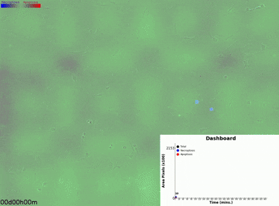

# DeathScope

<p align="center">
  
</p>

DeathScope is a label-free image-analysis pipeline for single-cell detection and phenotyping of programmed cell death in Incucyte phase-contrast time-lapse imaging. The repository contains the code used for the manuscript `DeathScope: A High-Throughput YOLO-Powered Cell Death Detection in Incucyte Phase-Contrast Imaging`, including:

- a YOLOv8-based detector for apoptosis and necroptosis
- RMH inference (`random cropping -> multiple predictions -> heatmap`) for full-frame probability maps
- an optional ConvNeXt-based second-stage classifier to split apoptosis-like regions into apoptosis versus pyroptosis
- training and batch-inference utilities used to generate manuscript figures and kinetics tables

## Results demo

MEFs undergoing T/S/V-induced necroptosis visualized with DeathScope:

[](docs/A2_2_death_image_green_wphase.mp4)

Click the preview above to open the full-resolution MP4: [`A2_2_death_image_green_wphase.mp4`](docs/A2_2_death_image_green_wphase.mp4)

## Status

This repository contains the public code release for the core DeathScope detection, heatmap inference, ConvNeXt refinement, and training workflows described in the manuscript.

## Repository layout

```text
.
├── README.md
├── requirements.txt
├── pyproject.toml
├── CITATION.cff
├── CODE_AVAILABILITY.md
├── DATA_AVAILABILITY.md
├── REPRODUCIBILITY.md
├── configs/
│   ├── README.md
│   └── cell_dataset.yaml
├── docs/
│   ├── README.md
│   └── deathscope_logo.png
├── examples/
│   ├── README.md
│   ├── ConvNeXt_data_demo/
│   └── mef_tsv_demo/
├── models/
│   ├── README.md
│   ├── pyroptosis/
│   │   ├── classes.json
│   │   └── convnext_large_model_best.pth
│   └── yolo/
│       └── deathscope_yolov8l.pt
├── outputs/
│   └── logs/
├── scripts/
│   ├── README.md
│   └── batch_predict.py
├── src/
│   └── deathscope/
│       ├── __init__.py
│       ├── cell_detector.py
│       ├── cli.py
│       └── pyro_classifier.py
└── training/
    ├── ConvNeXt/
    │   ├── README.md
    │   ├── ConvNeXt-Large_DataPreparation.ipynb
    │   ├── ConvNeXt-Large_training.ipynb
    │   ├── ConvNeXt-Large_plot.ipynb
    │   └── ConvNeXt-Large_prediction.ipynb
    └── YOLO/
        ├── README.md
        ├── train_yolo.ipynb
        └── train_yolo_script.py
```

## Method summary

The manuscript describes a two-stage workflow.

1. Phase-contrast images are processed with a YOLOv8 detector trained on fluorescence-anchored annotations generated with FluoroBoxer.
2. For full-frame inference, DeathScope uses RMH aggregation: many random overlapping crops are scored independently and merged into apoptosis and necroptosis heatmaps in image coordinates.
3. In the optional pyroptosis extension, apoptosis-like regions are passed to a ConvNeXt classifier that reassigns them to apoptosis or pyroptosis.

The code in `src/deathscope/cell_detector.py` implements the detector, tiling logic, RMH heatmap generation, batch export, and image overlays. The code in `src/deathscope/pyro_classifier.py` implements the optional second-stage pyroptosis classifier.

## Installation

Python 3.11 is the tested baseline for the current repository state. Use Python 3.11 or 3.12 for installation. Python 3.13 is not currently supported by the pinned dependency set in this repository.

Create an environment and install the dependencies:

```bash
python3 -m venv .venv
source .venv/bin/activate
pip install --upgrade pip
pip install -r requirements.txt
```

For editable installation of the repository package entry points:

```bash
pip install -e .
```

If you are currently using `python3.13`, create a `python3.11` or `python3.12` environment instead:

```bash
python3.11 -m venv .venv
source .venv/bin/activate
pip install --upgrade pip
pip install -e .
```

Then you can run:

```bash
deathscope-batch-predict --help
```

Notes:

- Install a PyTorch build appropriate for your platform and CUDA stack if you need GPU inference or training.
- The repository currently pins Python dependencies for reproducibility of the code release, not for minimal installation size.

## Quick start

### 1. Batch heatmap inference on an Incucyte-style dataset

Expected directory structure:

```text
dataset_name/
├── Phase/
│   ├── image_001.png
│   └── ...
└── Green/
    ├── image_001.png
    └── ...
```

Run the standard apoptosis/necroptosis pipeline:

```bash
python scripts/batch_predict.py \
  --input-root examples \
  --pattern "mef_tsv_demo" \
  --model models/yolo/deathscope_yolov8l.pt \
  --desired-coverage 20
```

Run the pyroptosis-enabled workflow:

```bash
python scripts/batch_predict.py \
  --input-root examples \
  --pattern "mef_tsv_demo" \
  --model models/yolo/deathscope_yolov8l.pt \
  --desired-coverage 20 \
  --pyro
```

Outputs are written next to the dataset folders as:

- per-frame overlay images
- per-dataset CSV summaries
- Incucyte-style aggregated CSV tables by well and by time
- run logs and JSON summaries under `outputs/logs/`

### 2. Programmatic usage

```python
import cv2
from deathscope import CellDetector

detector = CellDetector("models/yolo/deathscope_yolov8l.pt")
image = cv2.imread("path/to/phase_image.png", cv2.IMREAD_GRAYSCALE)

apoptosis_map, necroptosis_map, background_map = detector.predict_with_heatmap(
    image,
    conf=0.5,
    iou=0.5,
    desired_coverage=20,
)
```

## Training

YOLO detector training is documented under [training/YOLO/README.md](training/YOLO/README.md). The script entry point is:

```bash
python training/YOLO/train_yolo_script.py --data configs/cell_dataset.yaml --model yolov8l.pt
```

ConvNeXt classifier preparation, training, plotting, and prediction notebooks are documented under [training/ConvNeXt/README.md](training/ConvNeXt/README.md).

## Inputs and outputs

### Inputs

- 8-bit phase-contrast images for inference
- optional green-channel images for comparison to SYTOX Green or related fluorescence-derived readouts
- YOLO-format detection labels for training

### Outputs

- crop-level or full-frame detection results
- apoptosis and necroptosis probability heatmaps
- optional pyroptosis reassignment maps
- per-image and aggregated kinetics CSV files
- overlay PNGs for visual inspection

## Release guidance

Before public submission or publication, confirm the following:

- replace placeholder URLs and DOIs in the availability documents with final archival links
- decide and add an explicit software license
- move large raw datasets and final trained weights to an archival host such as Zenodo, Figshare, or institutional infrastructure if GitHub storage is not the final destination
- ensure the manuscript's reported model checkpoints, figure-generation scripts, and accession links match the tagged release

## Limitations

- The current implementation is optimized for 2D Incucyte-style phase-contrast imaging.

- The current two-stage stacked pipeline remains limited because pyroptosis was implemented as a second-stage classifier rather than a native detector class, and training was restricted to Bone marrow-derived macrophage images under limited conditions. Thus, this module serves primarily as a proof of concept for extending the core framework.

- Ground-truth generation and biological validation depend on the experimental design described in the manuscript and are not fully reproduced by this repository alone.

## Citation

If you use DeathScope, cite the manuscript and the archived software release described in [CITATION.cff](CITATION.cff).
